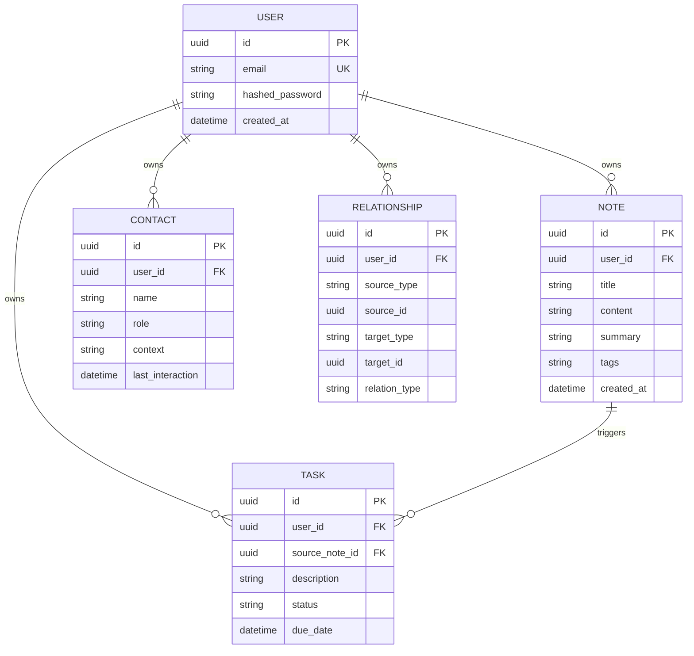

# Noted AI — Architecture & 5-Phase Implementation Plan

This document serves as the project blueprint for **Noted AI**, detailing the tech stack, switchable LLM kernels, database relations, data ingestion pipeline, and a structured 5-phase plan to achieve the product goals.

---

## 1. Technical Stack & Dependencies

*   **Frontend:** React (Vite-based), Tailwind CSS, Custom SVG Doodle Assets, and a Graph Visualization library (e.g. `react-force-graph` or `reactflow`).
*   **Backend:** FastAPI (Python), SQLAlchemy ORM (PostgreSQL database client), and Alembic for schema migrations.
*   **Vector Database:** ChromaDB (local / persistent client) storing note embeddings for conceptual semantic search.
*   **LLM Providers (Switchable Kernels):** 
    *   **Groq API** (for extremely low-latency chat and extraction).
    *   **Gemini API** (for advanced cognitive summaries, tags, and structured outputs).
    *   **Ollama (local)** (e.g. `llama3` or `mistral`, allowing local offline execution).

---

## 2. System Architecture & Directory Structure

```text
noted-ai/
├── backend/
│   ├── app/
│   │   ├── api/             # FastAPI Endpoint Controllers
│   │   │   ├── auth.py      # Flat user token-based auth
│   │   │   ├── notes.py     # Notes CRUD & ingestion triggering
│   │   │   ├── contacts.py  # Evolving contact profiles retrieval
│   │   │   ├── tasks.py     # Extracted task & deadline status updates
│   │   │   └── search.py    # Hybrid vector + keyword search queries
│   │   ├── core/            # Configuration, database connection, JWT security
│   │   │   ├── config.py
│   │   │   ├── db.py
│   │   │   └── security.py
│   │   ├── models/          # PostgreSQL SQLAlchemy database models
│   │   │   ├── user.py
│   │   │   ├── note.py
│   │   │   ├── contact.py
│   │   │   ├── task.py
│   │   │   └── relation.py
│   │   ├── schemas/         # Pydantic schemas for serialization / validation
│   │   ├── services/        # Logic & Core processing pipelines
│   │   │   ├── pipeline.py  # Orchestrates Ingestion: Summarize -> Extract -> Embed -> Store
│   │   │   ├── extractors.py# Prompts & parsing logic for entity/task extraction
│   │   │   └── vector_db.py # Interface to ChromaDB collection
│   │   ├── kernels/         # Switchable LLM providers
│   │   │   ├── base.py      # Abstract LLMKernelAdapter interface
│   │   │   ├── groq.py
│   │   │   ├── gemini.py
│   │   │   └── ollama.py
│   │   └── main.py          # App startup script
│   ├── requirements.txt
│   └── alembic/             # Migration scripts
├── frontend/
│   ├── src/
│   │   ├── components/      # Reusable visual components (Editor, DoodleIllustrations, Graph)
│   │   ├── context/         # React Context stores (Authentication, Active Kernel Settings)
│   │   ├── hooks/           # Custom API query hooks
│   │   ├── pages/           # Page structures (Home, Notes, Timeline, Graph, Contacts, Tasks)
│   │   ├── utils/           # Doodling helpers, Markdown parsing utilities
│   │   ├── App.jsx
│   │   ├── main.jsx
│   │   └── index.css        # Core stylesheet (Google-inspired off-white styling)
│   ├── package.json
│   └── vite.config.js
```

---

## 3. Database Schema Foundations (Flat User Mode)

We utilize a PostgreSQL database managed via SQLAlchemy. Relationships between notes, contacts, tasks, and timeline events are structured as follows:



---

## 4. Multi-LLM Switchable Kernel Wrapper

To keep LLM backends interchangeable, the application defines a base interface (`LLMKernelAdapter`) that encapsulates the required operations:

```python
# backend/app/kernels/base.py
from abc import ABC, abstractmethod
from typing import List, Dict, Any

class LLMKernelAdapter(ABC):
    @abstractmethod
    async def chat_completion(self, messages: List[Dict[str, str]]) -> str:
        """Standard chat response generation."""
        pass

    @abstractmethod
    async def generate_embeddings(self, text: str) -> List[float]:
        """Generate vector embedding representation of the given text."""
        pass

    @abstractmethod
    async def extract_structured_data(self, text: str, schema: Any) -> Dict[str, Any]:
        """Perform structured extraction (tags, summary, contacts, tasks) from text."""
        pass
```

A backend configuration parameter determines which client (`GroqAdapter`, `GeminiAdapter`, or `OllamaAdapter`) is instantiated at runtime.

---

## 5. The 5-Phase Implementation Plan

### Phase 1: Foundation & Infrastructure (Auth, Database, Kernels)
*   **Goal:** Setup backend/frontend skeletons, database connections, flat user tables, and switchable adapter patterns.
*   **Deliverables:**
    *   FastAPI boilerplate with environment variable loading.
    *   PostgreSQL models with Alembic migrations.
    *   ChromaDB vector store connection client.
    *   `LLMKernelAdapter` implementations for Groq, Gemini, and local Ollama.
    *   Flat-user login and JWT generation.
    *   Vite React frontend workspace initialized with CSS style tokens.

### Phase 2: Markdown Editor & Ingestion Pipeline
*   **Goal:** Create a markdown-enabled editor that submits content to the automated ingestion pipeline.
*   **Deliverables:**
    *   Markdown Note Editor component with state indicators (`✦ Remembering this...`).
    *   CRUD endpoints for Note entity storage.
    *   Orchestration Pipeline service which processes notes sequentially:
        1. **Summarizer:** Auto-generates clean summaries and titles.
        2. **Entity Extractor:** Extracts tags and mentioned entities.
        3. **Task & Date Extractor:** Locates actionable items.
        4. **Embedding Service:** Vectorizes text.
        5. **Relationship Builder:** Links items in the PostgreSQL `RELATIONSHIP` table.
        6. **Persistent Storage:** Commits SQL entries and writes vectors to ChromaDB.

### Phase 3: Contact Aggregation, Tasks & Timeline
*   **Goal:** Synthesize timeline logs and populate Contact and Task databases.
*   **Deliverables:**
    *   Aggregation mechanism updating `Contact` profiles over multiple note mentions.
    *   Task manager view for checking off auto-extracted commitments.
    *   Vertical chronological **Memory Timeline** displaying a clean flow of notes, events, and created relationships.

### Phase 4: Hybrid Search, Graph & Q&A ("Ask Noted")
*   **Goal:** Allow retrieval of information via semantic search, natural language queries, and visual graph mapping.
*   **Deliverables:**
    *   ChromaDB semantic search endpoint explaining the conceptual match (e.g. matching terms).
    *   **Ask Noted** Q&A chat endpoint that compiles notes, contact info, and related tasks into context for LLM question answering (providing evidence-backed answers).
    *   Interactive SVG/Canvas **Knowledge Graph** visualizing notes, tasks, and contacts as connected nodes.

### Phase 5: Proactive Memory Agent, Specialized Extractor Types & Polish
*   **Goal:** Add proactive monitoring, specialized memory structures, and doodles for empty states.
*   **Deliverables:**
    *   **Proactive Memory Agent:** A background worker checking SQL database for commitments that haven't been updated in a specified period and suggesting follow-up items.
    *   **Memory Importance Scoring:** AI scores memories (1–10) to prioritize high-value matches in search retrieval.
    *   **Specialized Memory Types:** Specific extraction formats for Ideas, Meetings, Decisions, and Expenses.
    *   Doodle styling (hand-drawn illustrations for empty states, timeline paths, UI accents).
